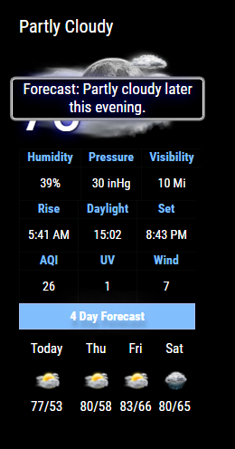
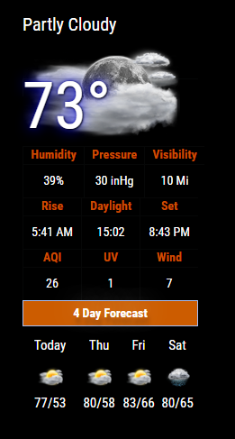
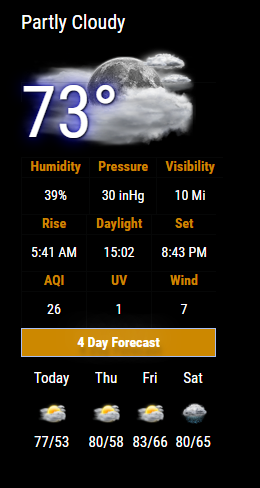
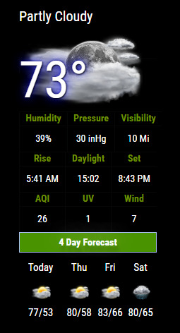
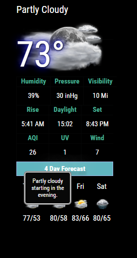

This repository is maintained by Cowboysdude 
[This is the third version of this module for MagicMirror2]

# MMM-NOAA V3.0

**Weather for your mirror**

* Also UV index and Air Quality Index.  [Warning AQI may not work in all areas].

## Examples

See below!!  

* Automatically adjusts language and all other settings based on your config.js!

## Your terminal installation instructions

* `git clone https://github.com/cowboysdude/MMM-NOAA3` into the `~/MagicMirror/modules` directory.
*  `cd MMM-NOAA3`
*  `npm install`

## Get your free API key here [WEATHER, You must also get an AirAPI Key--- see below]

There are multiple providers to choose from:  You only need one api from one of these providers below:

* weatherbit ~ https://www.weatherbit.io/api
* darksky ~ https://darksky.net/dev
* apixu ~ https://www.apixu.com/
* weatherunlocked ~ https://developer.weatherunlocked.com/   [provides both api and appid keys, need them both, see example]
* accuweather ~ https://developer.accuweather.com/
* openweather ~ https://openweathermap.org/api
* yahoo [NO API key needed for this one]


## Get your AirKEY from here

[https://airvisual.com/api](https://airvisual.com/api)

## Config.js entry and options

Will automatically select translation file and either F or C by reading your defaults from the config.js file [at the top]
Will default to EN if NO translation file is found.  
   
## Provider name MUST be in the config.js. Here they are:
	 
* weatherbit  
* darksky 
* apixu 
* weatherunlocked 
* accuweather  
* openweather 
* yahoo
    
* For all of them EXCEPT YAHOO and WEATHERUNLOCKED
     ```   {
        module: 'MMM-NOAA3',
        config: {
		    provider: "must be in quotes", // From list above
		    apiKey: "YOUR API KEY",        // From one of the providers listed above
		    airKey: "YOUR API KEY",    
	        css: "NOAA3"                   // THIS MUST CONTAIN A CSS STYLE NAME 
	 }
         },
	```
* WeatherUnlocked API Example:
	```
	  {
        module: 'MMM-NOAA3',
        config: {
		    provider: "weatherunlocked",       
		    apiKey: "YOUR API KEY",  
		    appID: "YOUR APP ID",  
		    airKey: "YOUR API KEY", 
	        css: "NOAA3"                  // THIS MUST CONTAIN A CSS STYLE NAME
	 }
         },
	```
* Yahoo Example:
	```
	 {
        module: 'MMM-NOAA3',
        config: {
		    provider: "Yahoo",   
		    airKey: "YOUR API KEY", 
	        css: "NOAA3"                 // THIS MUST CONTAIN A CSS STYLE NAME 
	}
    },
	```
	
## ISSUES

  While we tried to make NOAA everything a weather module can be, not everyone will give out weather warnings with the free api key.
  Thanks to Wunderground going belly up on the users........ soooooo we suggest that you use this module for warnings->	
  
  https://github.com/LukeSkywalker92/MMM-DWD-WarnWeather
  
  This is a weather warning module that will fit the bill nicely :)
  
## UpdateInterval

Via the config you can change this..... currently it's set to 30 minutes like this ->  updateInterval: 30 * 60 * 1000

You can add this to your config.js to change it if you'd like ... like this ->

    {
        module: 'MMM-NOAA3',
        config: {
		    provider: "Yahoo",   
		    airKey: "YOUR API KEY", 
	        css: "NOAA3",   // THIS MUST CONTAIN A CSS STYLE NAME
		    updateInterval: 15 * 60 * 1000 // every 15 minutes or whatever you choose but make sure you have an api that will allow that many calls per day!!! 
	}
    },
	
## CSS STYLES

* You can choose one of 4 styles [colors] for NOAA3

##NOAA1 (Color style #1)  
 

##NOAA2 (Color style #2)  
 

##NOAA3 (Color style #3)  
 


##NOAA4 (Changes colors automatically)  

 
 
 
 



## Start your mirror . . . enjoy! 
